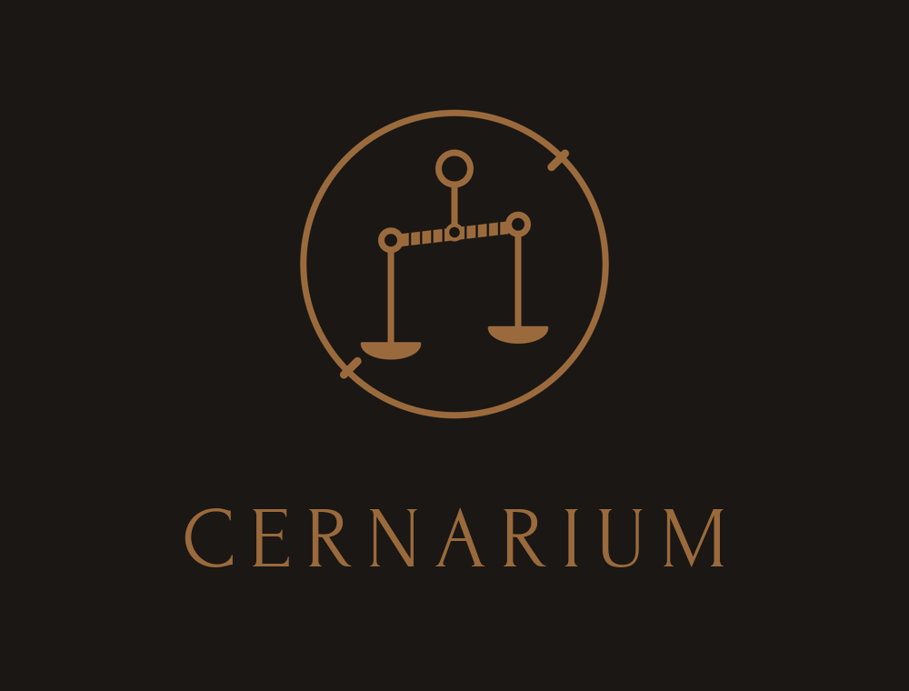

  

# Cernarium

A benchmark result is a valid observation within its own frame, never a general truth.

This is Cernarium's first public object: the method comes before the results it bounds.

Cernarium is a method for keeping the public sentence drawn from a benchmark inside the frame that produced it. A public claim is an authored object: evidence can support it, but it does not write the claim by itself.

## What this is

A small, inspectable method for bounding the claims made from benchmark results. It defines, for each public claim, the wider statements it does not license, and a narrower replacement that stays publishable.

The accompanying boundary table is the instrument. A claim, its forbidden expansions, and its allowed replacement sit together, written down, where a reader can check them.

## What this is not

This repository publishes a method, not a result. It does not evaluate any benchmark, scoring rule, or model behavior, and it discloses no benchmark result. See [NON_CLAIMS.md](NON_CLAIMS.md) for the explicit limits.

## Public method objects

- [NOTE.md](NOTE.md) - the canonical note: thesis, method, and a form-only example.
- [claim_boundary_table.md](claim_boundary_table.md) - the boundary table, readable.
- [claim_boundary_table.json](claim_boundary_table.json) - the same table, structured.
- [NON_CLAIMS.md](NON_CLAIMS.md) - what this repository does not claim.

## How to read the boundary table

Each entry holds three parts: an allowed statement (what may be said, inside its frame), forbidden expansions (the wider readings it refuses, named one by one), and an allowed replacement (a narrower sentence that keeps the result useful). The table is a guardrail for public language, not evidence for any result.

## License

Content (method, text, tables, assets) is released under [CC-BY-4.0](LICENSE). The Cernarium name and visual identity are provided for attribution and reference; their use does not imply endorsement.
